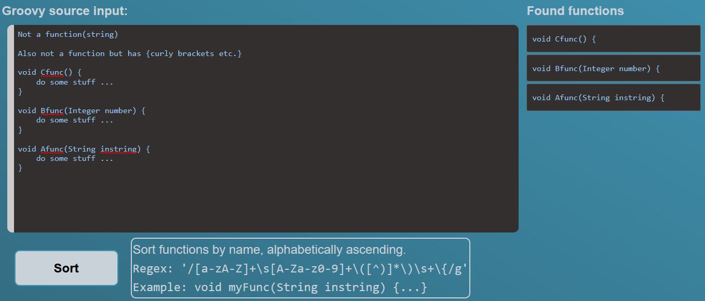
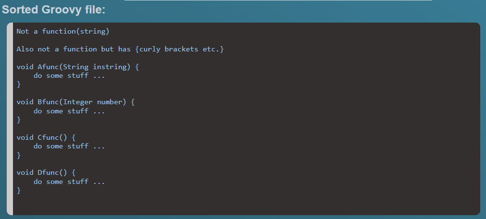

# Groovy sorting

A simple app to sort functions in any `groovy` file by their name.

## Usage

A web interface of this app is provided via **GitHub Pages** at: [Groovy-sorting](https://falcontube.github.io/groovy-sorting/)

Simply insert any groovy script into the upper code block. The app will find all functions automatically.


Hit `Sort` and the app will sort do the following:

1. Remove all found functions
2. Strip remaining whitespace from bottom of file
3. Append all functions to end of file in order



## Local usage

Clone the git repo and execute the following code in the source directory:

```bash
# In groovy-sorting
npm install
npm run dev -- --open
```